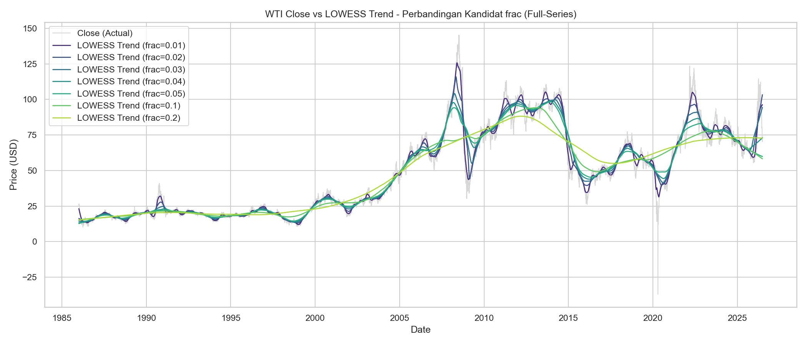
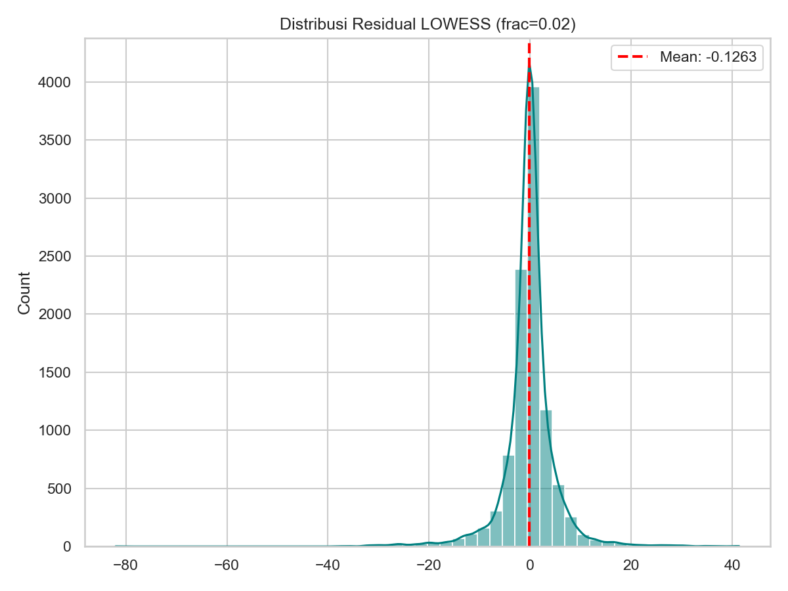
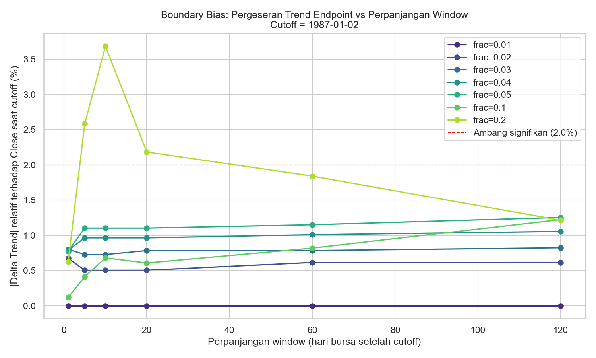
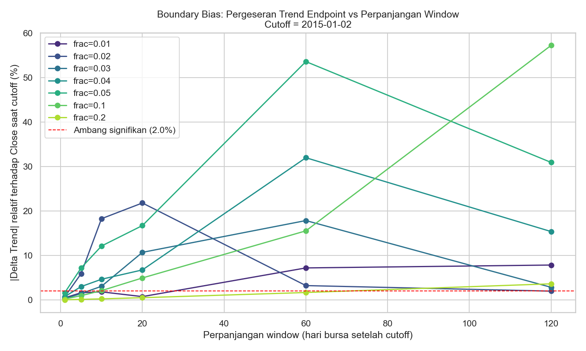

# Final Report Essence

Ringkasan padat dari `final-report.md`, hanya poin penting dan gambar.
File ini disinkronkan ulang setiap perintah "update essence", mengikuti bagian baru yang belum ada di sini.

## 1. LOWESS

Close bersifat non stasioner, LOWESS dipakai mengekstrak komponen Trend jangka panjang yang smooth, sisanya (Residual) diproses CEEMDAN.

```
Close = Trend (LOWESS) + Residual
```

Kode produksi (`10-expanding-window-decomposition.py`, repo thesis), expanding window per hari, Trend diambil dari endpoint smoothing.

```python
FRAC = 0.02
def extract_trend_and_residual(close_window):
    x = np.arange(len(close_window))
    smoothed = lowess(close_window, x, frac=FRAC, return_sorted=False)
    trend_t = smoothed[-1]
    residual_window = close_window - smoothed
    return trend_t, residual_window
```

`WARMUP_MINIMUM = 500` menentukan `start_t` loop di `main()`, bukan bagian dari fungsi ekstraksi di atas. Baris sebelum t=500 tidak pernah diproses, itu sebabnya dataset final mulai 1988-01-11 bukan 1986-01-02.

Frac 0.02 dipilih dari 7 kandidat, dua alasan utama.

Kualitas smoothing, kurtosis Residual turun tajam dari frac 0.01 ke 0.02 (26.74 menjadi 15.66).
Stabilitas endpoint (metrik k=1, paling relevan karena produksi cuma maju 1 hari per langkah), frac 0.02 pergeseran terendah (0.688%), 0% kombinasi signifikan dari 9 titik cutoff.

Boundary bias pada rezim structural break ekstrem (crash minyak 2014-2016) diterima sebagai keterbatasan struktural LOWESS, sudah dicoba dimitigasi tapi gagal, sehingga tidak ada algoritma tambahan di pipeline produksi.









