# Final Report Essence

Ringkasan padat dari `final-report.md`, hanya poin penting dan gambar.
File ini disinkronkan ulang setiap perintah "update essence", mengikuti bagian baru yang belum ada di sini.

## 1. LOWESS

### 1.1. Konsep dan Mengapa

Close bersifat non stasioner, LOWESS dipakai mengekstrak komponen Trend jangka panjang yang smooth, bukan menstasionerkan lewat differencing atau log return.
Sisanya (Residual) diproses CEEMDAN untuk dipecah lagi menjadi IMF di sekitar nol.
Trend menjadi salah satu dari 4 fitur input model deep learning proyek ini (Trend, IMF Group 1, IMF Group 2, Residual).

```
Close = Trend (LOWESS) + Residual
```

Parameter utama, `frac`, dipilih dari 7 kandidat (0.01 sampai 0.20), dua pertimbangan utama.

Kualitas smoothing, kurtosis Residual turun tajam dari frac 0.01 ke 0.02 (26.74 menjadi 15.66).
Stabilitas endpoint (metrik k=1, paling relevan karena produksi cuma maju 1 hari per langkah), frac 0.02 pergeseran terendah (0.688%), 0% kombinasi signifikan dari 9 titik cutoff.

Boundary bias pada rezim structural break ekstrem (crash minyak 2014-2016) diterima sebagai keterbatasan struktural LOWESS, sudah dicoba dimitigasi (additive outlier modeling, tuning iterasi robust reweighting) tapi gagal, sehingga tidak ada algoritma tambahan di pipeline produksi.

**Expanding window.** Supaya tidak ada kebocoran data masa depan, LOWESS (dan CEEMDAN di Bagian 2) dihitung ulang tiap hari memakai window yang MENGEMBANG, di hari t window-nya `Close[0:t+1]`, seluruh histori dari hari pertama sampai hari t, bukan window berukuran tetap. Ini beda dengan window/lag berukuran tetap 10 hari yang dipakai di tahap Feature Engineering (Bagian 3), keduanya sama sama disebut "window" tapi konsepnya berbeda.

### 1.2. Code Snippet

Kode produksi (`10-expanding-window-decomposition.py`, repo thesis), expanding window per hari, Trend diambil dari endpoint smoothing.

```python
FRAC = 0.02          # dikonfirmasi final, modeling-plan-lowess.md
WARMUP_MINIMUM = 500  # baris pertama dipakai warmup, di-drop dari dataset final

def extract_trend_and_residual(close_window):
    """Modul LOWESS, return Trend_t (endpoint) dan
    Residual_window (seluruh kurva, dipakai sbg input CEEMDAN)."""
    x = np.arange(len(close_window))
    smoothed = lowess(close_window, x, frac=FRAC, return_sorted=False)
    trend_t = smoothed[-1]
    residual_window = close_window - smoothed
    return trend_t, residual_window
```

`WARMUP_MINIMUM` tidak dipakai di dalam fungsi ekstraksi di atas, fungsi itu murni menerima `close_window` apa pun yang dikirim kepadanya.
`WARMUP_MINIMUM` dipakai di fungsi `main()`, menentukan titik awal `t` pada loop produksi (`start_t`), sekaligus logika resume kalau proses sempat dihentikan.

```python
if os.path.exists(OUTPUT_PATH):
    existing_df = pd.read_csv(OUTPUT_PATH)
    n_done = len(existing_df)
    start_t = WARMUP_MINIMUM + n_done   # resume, lanjut dari progress terakhir
else:
    start_t = WARMUP_MINIMUM             # run baru, mulai dari t = 500

for t in range(start_t, n_total):
    close_window = close[0:t + 1]
    trend_t, residual_window = extract_trend_and_residual(close_window)
    ...
```

Baris sebelum t=500 tidak pernah masuk loop, otomatis tidak ada di dataset final, itu sebabnya dataset final mulai 1988-01-11 bukan 1986-01-02 (bukan karena ada pengecekan warmup di dalam fungsi ekstraksinya).

**Kenapa 500 baris pertama dilewati.** Seperti moving average, riwayat yang terlalu sedikit membuat Trend tidak bisa dipercaya, jadi Trend baru disimpan mulai hari ke-501. 500 hari pertama tetap dipakai sebagai modal riwayat perhitungan (window t=500 adalah `Close[0:501]`), hanya hasilnya di hari ke-0 sampai ke-499 tidak disimpan. Angka 500 sendiri warisan dari uji coba kecepatan CEEMDAN lain, bukan hasil validasi khusus seperti frac 0.02.

### 1.3. Output (Tabel Statistik dan Graphical)

Contoh 5 baris pertama dan 5 baris terakhir hasil Trend dan Residual (frac 0.02), dari dekomposisi full series (bukan dataset produksi expanding window, cuma untuk ilustrasi bentuk hasil LOWESS).

Head (5 baris pertama)

| Date | Close | Trend (frac 0.02) | Residual (frac 0.02) |
|---|---:|---:|---:|
| 1986-01-02 | 25.56 | 16.3219 | 9.2381 |
| 1986-01-03 | 26.00 | 16.2890 | 9.7110 |
| 1986-01-06 | 26.53 | 16.2562 | 10.2738 |
| 1986-01-07 | 25.85 | 16.2236 | 9.6264 |
| 1986-01-08 | 25.87 | 16.1912 | 9.6788 |

Tail (5 baris terakhir)

| Date | Close | Trend (frac 0.02) | Residual (frac 0.02) |
|---|---:|---:|---:|
| 2026-06-23 | 74.62 | 102.1822 | -27.5622 |
| 2026-06-24 | 71.42 | 102.4651 | -31.0451 |
| 2026-06-25 | 72.67 | 102.7478 | -30.0778 |
| 2026-06-26 | 70.30 | 103.0305 | -32.7305 |
| 2026-06-29 | 71.87 | 103.3131 | -31.4431 |

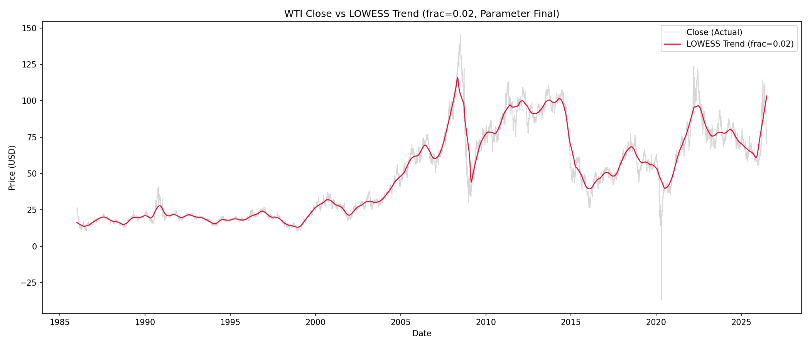

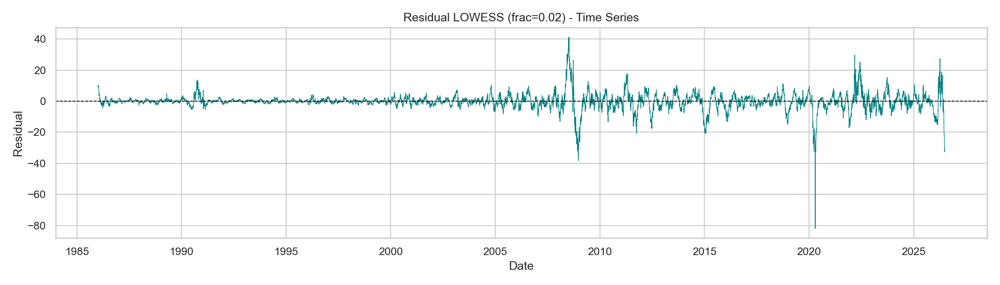

## 2. CEEMDAN

### 2.1. Konsep dan Mengapa

Residual hasil LOWESS masih campuran osilasi cepat (noise harian) dan osilasi lambat (siklus jangka menengah). CEEMDAN memecahnya jadi beberapa IMF (Intrinsic Mode Function), tiap IMF mewakili satu skala osilasi, dari frekuensi tinggi ke rendah, plus satu residue akhir.

```
Residual (LOWESS) = IMF_1 + IMF_2 + ... + IMF_n + res
```

Masalahnya, jumlah IMF yang dihasilkan tidak konsisten antar window (bisa 9, 10, atau 11), tidak bisa langsung dipakai sebagai fitur karena dimensi input model harus tetap. Solusinya, IMF dikelompokkan jadi N=2 grup tetap berdasarkan karakteristik osilasinya (ZCR dan Sample Entropy), bukan berdasarkan urutan indeksnya.

```
Residual (LOWESS) = group_1 (noise-like) + group_2 (trend-like) + res
```

Trend, group_1, group_2, res inilah 4 fitur input model deep learning proyek ini.

### 2.2. Code Snippet

Kode produksi (`09-ceemdan-decomposition-module.py` untuk modul, dipanggil dari `10-expanding-window-decomposition.py` untuk loop harian, repo thesis). Tiap IMF diberi skor komposit dari ZCR (seberapa sering ganti tanda, sinyal noise menyeberangi nol lebih sering) dan SampEn (seberapa tidak teratur sinyalnya), dirangking relatif per window, lalu dibelah di median.

```python
def zcr(imf):
    zero_crosses = np.nonzero(np.diff(np.sign(imf)))[0]
    return len(zero_crosses) / len(imf)


def decompose_residual(residual_series, trials=TRIALS):
    """Modul reusable, pecah Residual jadi group_1 (noise-like),
    group_2 (trend-like), res (residue akhir CEEMDAN)."""
    imfs = CEEMDAN(trials=trials, parallel=False)(residual_series)
    imf_rows = imfs[:-1]
    res = imfs[-1]

    zcrs = np.array([zcr(imf) for imf in imf_rows])
    sampens = np.array([
        sample_entropy(imf, order=2, metric='chebyshev') for imf in imf_rows
    ])

    rank_zcr = pd.Series(zcrs).rank().to_numpy()
    rank_sampen = pd.Series(sampens).rank().to_numpy()
    composite = (rank_zcr + rank_sampen) / 2
    median_composite = np.median(composite)

    noise_mask = composite > median_composite
    trend_mask = ~noise_mask

    group_1 = imf_rows[noise_mask].sum(axis=0) if noise_mask.any() else np.zeros_like(res)
    group_2 = imf_rows[trend_mask].sum(axis=0) if trend_mask.any() else np.zeros_like(res)

    return {'group_1': group_1, 'group_2': group_2, 'res': res}
```

`parallel=False` di `CEEMDAN(trials=trials, parallel=False)` wajib ditulis eksplisit. Kalau tidak, PyEMD diam-diam menyalakan mode banyak proses sekaligus (`parallel=True`), dan karena fungsi ini dipanggil ulang ribuan kali (setiap hari, sepanjang loop produksi), proses yang dibuka berulang-ulang itu lama-lama menghabiskan resource Windows dan bikin crash di tengah jalan. Selain lebih stabil, `parallel=False` juga terbukti lebih cepat daripada mode banyak proses.

### 2.3. Output (Tabel Statistik dan Graphical)

Validasi modul (trials=100, full series 10.191 baris, dataset EIA 1986-2026) menghasilkan 11 IMF, split 5 banding 6 (IMF 1-5 group_1 noise-like, IMF 6-11 group_2 trend-like), identik dengan pola split dataset lama meski panjang data berbeda.

Skor komposit dihitung dari ranking, bukan dari nilai ZCR/SampEn mentah langsung. Tiap IMF diurutkan dari nilai terkecil ke terbesar secara terpisah untuk ZCR dan untuk SampEn, lalu diberi peringkat 1 sampai 11. IMF 1 punya ZCR dan SampEn terbesar di antara semua IMF, jadi dapat peringkat 11 di kedua metrik, skor komposit = (11+11)/2 = 11.0. Skor 9.5 (IMF 2 dan IMF 3) bukan berarti nilai mentahnya sama, melainkan keduanya saling tukar posisi antar dua metrik (IMF 2 unggul di ZCR peringkat 10, kalah di SampEn peringkat 9, IMF 3 sebaliknya), rata-rata 9 dan 10 sama sama menghasilkan 9.5.

Dua pengecekan juga dilakukan untuk memastikan tidak ada sinyal yang hilang atau bocor saat dijumlah ulang, apakah Residual sama persis dengan group_1+group_2+res, dan apakah Close sama persis dengan Trend+group_1+group_2+res. Keduanya cocok, selisihnya cuma di angka desimal ke-14 (0.0000000000000142 dan seterusnya), sekadar pembulatan komputer, bukan kesalahan perhitungan.

| IMF | ZCR | Sample Entropy | Skor komposit | Grup |
|---|---:|---:|---:|---|
| 1 | 0.6412 | 0.6659 | 11.0 | group_1 (noise) |
| 2 | 0.3099 | 0.4681 | 9.5 | group_1 (noise) |
| 3 | 0.1570 | 0.4821 | 9.5 | group_1 (noise) |
| 4 | 0.0762 | 0.3655 | 8.0 | group_1 (noise) |
| 5 | 0.0315 | 0.1723 | 7.0 | group_1 (noise) |
| 6 | 0.0143 | 0.0596 | 6.0 | group_2 (trend) |
| 7 | 0.0075 | 0.0372 | 5.0 | group_2 (trend) |
| 8 | 0.0036 | 0.0177 | 4.0 | group_2 (trend) |
| 9 | 0.0019 | 0.0051 | 2.5 | group_2 (trend) |
| 10 | 0.0010 | 0.0076 | 2.5 | group_2 (trend) |
| 11 | 0.0004 | 0.0035 | 1.0 | group_2 (trend) |

Contoh 5 baris pertama dan 5 baris terakhir hasil group_1, group_2, res (dataset validasi full series, bukan expanding window produksi), dibandingkan dengan Residual LOWESS asli.

Head (5 baris pertama)

| Date | Residual (LOWESS) | group_1 | group_2 | res |
|---|---:|---:|---:|---:|
| 1986-01-02 | 9.2381 | 4.6960 | 4.3750 | 0.1671 |
| 1986-01-03 | 9.7110 | 5.2026 | 4.3413 | 0.1671 |
| 1986-01-06 | 10.2738 | 5.8016 | 4.3051 | 0.1671 |
| 1986-01-07 | 9.6264 | 5.1930 | 4.2663 | 0.1671 |
| 1986-01-08 | 9.6788 | 5.2867 | 4.2250 | 0.1671 |

Tail (5 baris terakhir)

| Date | Residual (LOWESS) | group_1 | group_2 | res |
|---|---:|---:|---:|---:|
| 2026-06-23 | -27.5622 | -31.0049 | 4.4525 | -1.0098 |
| 2026-06-24 | -31.0451 | -34.3002 | 4.2650 | -1.0099 |
| 2026-06-25 | -30.0778 | -33.1516 | 4.0837 | -1.0099 |
| 2026-06-26 | -32.7305 | -35.6295 | 3.9089 | -1.0099 |
| 2026-06-29 | -31.4431 | -34.1737 | 3.7405 | -1.0100 |

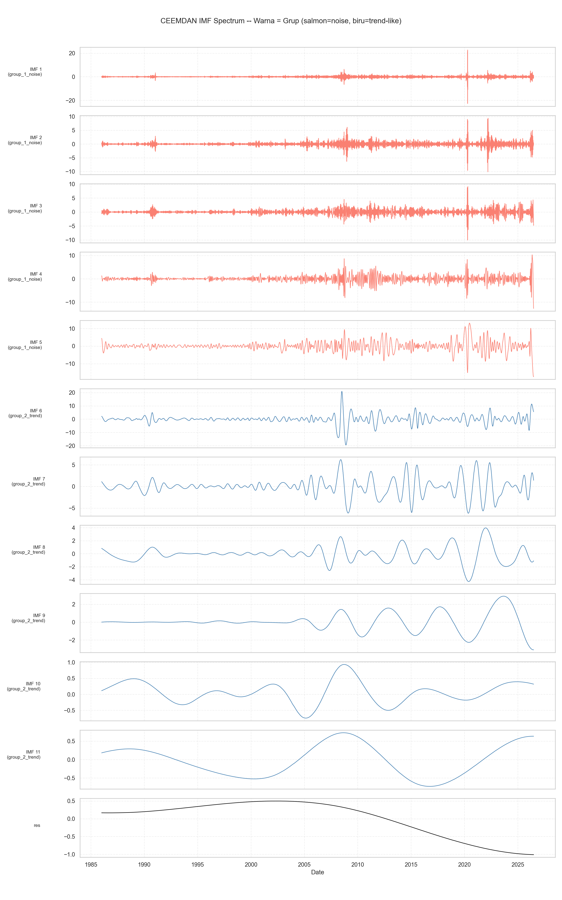

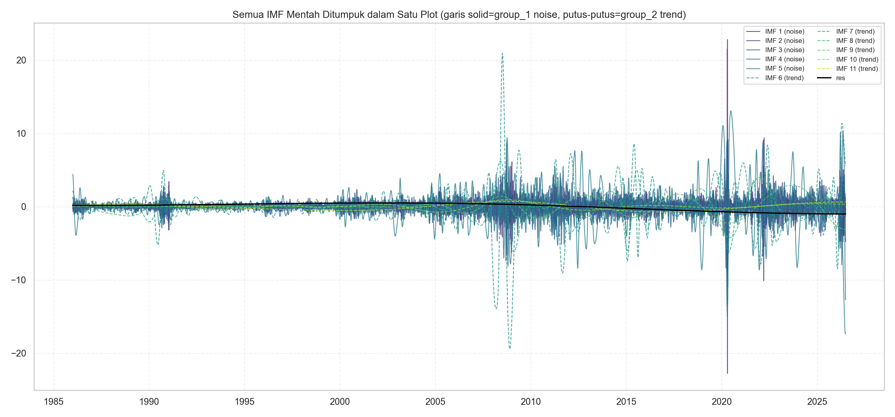

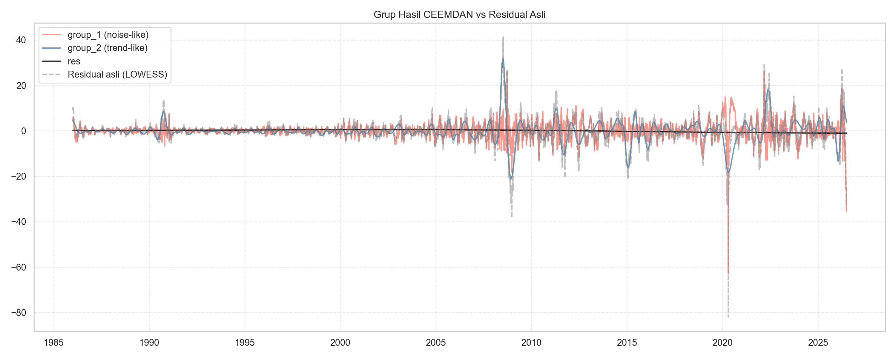

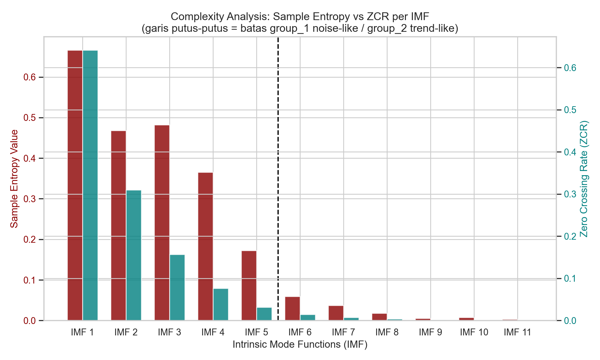

## 3. Feature Engineering (Windowing/Lag)

### 3.1. Konsep dan Alasan

Model deep learning butuh konteks historis, bukan cuma nilai 4 komponen (Trend, group_1, group_2, res) di satu titik waktu saja. Tahap ini mengubahnya jadi pasangan input-output lewat windowing/lag, ambil n hari ke belakang sebagai input (X), nilai komponen hari itu sendiri sebagai target (y).

```
X = [komponen_(t-n), ..., komponen_(t-1)]   (lag_1 sampai lag_n)
y = komponen_t
```

Windowing dilakukan SEBELUM split Train/Test/Unseen, di atas satu series kontinu penuh, supaya baris awal tiap partisi (terutama Test/Unseen) tidak kehilangan akses ke lag dari ekor partisi sebelumnya.

Di proyek ini, tiap baris data dibentuk ulang jadi semacam "tabel mini" berukuran 10 baris x 4 kolom, 10 baris untuk 10 hari terakhir (lookback), 4 kolom untuk keempat komponen (Trend, group_1, group_2, res). Satu model per arsitektur (8 arsitektur total) membaca tabel mini ini dan langsung menebak harga penutupan besok (`actual_close`), bukan menebak tiap komponen satu-satu dengan model terpisah.

### 3.2. Code Snippet

Langkah 1, bentuk lag_1 sampai lag_n dan target per komponen (`12-ceemdan-feature-engineering.py`, repo thesis), dijalankan sekali untuk n=10 dan n=20.

```python
COMPONENTS = ['Trend', 'group_1', 'group_2', 'res']
WINDOW_LENGTHS = [10, 20]

def build_windowed_dataset(df, n, components):
    """Untuk tiap target index t (mulai dari index n), bentuk lag_1..lag_n
    dan target_<komponen> untuk SETIAP komponen, plus actual_close
    (referensi evaluasi, bukan target training)."""
    dates = df['Date'].values
    actual_close = df['actual_close'].values
    comp_arrays = {c: df[c].values for c in components}

    rows = []
    for t in range(n, len(df)):
        row = {'Date': dates[t]}
        for c in components:
            lag_window = comp_arrays[c][t - n:t]  # komponen_(t-n) ... komponen_(t-1)
            row.update({f'{c}_lag_{n - i}': lag_window[i] for i in range(n)})
            row[f'target_{c}'] = comp_arrays[c][t]
        row['actual_close'] = actual_close[t]
        rows.append(row)

    return pd.DataFrame(rows)
```

Langkah 2, dataset hasil langkah 1 (`WTI-CEEMDAN-FE-n10.csv`, masih berbentuk flat, 46 kolom) di-reshape jadi tabel mini `(batch, 10, 4)` untuk proyek ini (`04-fe-and-split.py`, fungsi `build_xy`).

```python
LOOKBACK = 10
COMPONENTS = ["Trend", "group_1", "group_2", "res"]
N_FEATURES = len(COMPONENTS)

def build_xy(df):
    """Reshape pre-windowed rows to (N, T=10, F=4). lag_10 = t-9 (oldest),
    lag_1 = t-0 (newest)."""
    N = len(df)
    X = np.zeros((N, LOOKBACK, N_FEATURES), dtype=np.float64)
    for f, comp in enumerate(COMPONENTS):
        for t in range(LOOKBACK):
            lag = LOOKBACK - t
            X[:, t, f] = df[f"{comp}_lag_{lag}"].values
    y = df["actual_close"].values.astype(np.float64)
    return X, y
```

`t=0` (baris pertama tabel mini) diisi `lag_10`, hari PALING LAMA (t-9). `t=9` (baris terakhir) diisi `lag_1`, hari PALING BARU (t-0, tepat sebelum hari yang ditebak). Urutan lama ke baru ini mengikuti cara model deep learning membaca sequence.

### 3.3. Output (Tabel Dataset)

`WTI-CEEMDAN-FE-n10.csv`, 9.681 baris x 46 kolom (10 lag x 4 komponen + 4 target per komponen + `actual_close` + `Date`). Contoh 5 baris pertama dan 5 baris terakhir, dipangkas hanya kolom penting (lag tertua dan terbaru tiap komponen, plus target harga).

Head (5 baris pertama)

| Date | Trend_lag_10 | Trend_lag_1 | group_1_lag_1 | group_2_lag_1 | res_lag_1 | actual_close |
|---|---:|---:|---:|---:|---:|---:|
| 1988-01-11 | 16.6091 | 17.5146 | 0.0160 | -0.1868 | -0.0137 | 16.63 |
| 1988-01-12 | 16.5871 | 17.2587 | -0.4353 | -0.1826 | -0.0108 | 16.76 |
| 1988-01-13 | 16.7853 | 16.7699 | 0.1845 | -0.1819 | -0.0126 | 16.56 |
| 1988-01-14 | 16.9164 | 16.5165 | 0.2351 | -0.1802 | -0.0113 | 17.10 |
| 1988-01-15 | 16.8742 | 16.5048 | 0.4162 | 0.1879 | -0.0089 | 16.92 |

Tail (5 baris terakhir)

| Date | Trend_lag_10 | Trend_lag_1 | group_1_lag_1 | group_2_lag_1 | res_lag_1 | actual_close |
|---|---:|---:|---:|---:|---:|---:|
| 2026-06-23 | 105.7098 | 106.2703 | -30.4308 | 3.7252 | -0.6247 | 74.62 |
| 2026-06-24 | 105.9212 | 105.8682 | -30.4473 | 0.2392 | -1.0401 | 71.42 |
| 2026-06-25 | 106.1539 | 105.2533 | -34.8069 | 2.0418 | -1.0682 | 72.67 |
| 2026-06-26 | 106.3517 | 104.6226 | -35.0813 | 2.4953 | 0.6334 | 70.30 |
| 2026-06-29 | 106.5038 | 103.9256 | -33.9244 | 1.4342 | -1.1355 | 71.87 |

## 4. Split Train, Test, Unseen

### 4.1. Konsep dan Alasan

Data time series tidak boleh dipecah acak seperti data tabular biasa, urutan waktu itu sendiri bagian dari informasi yang harus dijaga, model tidak boleh "mengintip" data masa depan saat training. Split dilakukan secara KRONOLOGIS, potongan pertama (paling lama) untuk Train, potongan berikutnya untuk Test, potongan terakhir (paling baru) untuk Unseen, tanpa pengacakan urutan sama sekali.

Proyek ini menjalankan DUA skema split terpisah.

`full`, memakai SELURUH baris dataset (9.681 baris, 1988-01-11 sampai 2026-06-29), dibagi 80/10/10 menjadi Train, Test, Unseen.
`wu`, memakai SUBSET dataset yang dipotong sampai `Date <= 2020-02-10`, dibagi 80/20 menjadi Train, Test saja (tanpa Unseen), meniru rentang data studi acuan benchmark Wu et al.

`full` untuk mengukur performa model pada rentang waktu paling panjang dan terbaru, `wu` khusus untuk perbandingan yang lebih adil terhadap studi acuan yang berhenti di 2020-02-10.

### 4.2. Code Snippet

Split dilakukan dengan slicing index biasa (bukan fungsi split scikit-learn yang defaultnya mengacak), karena data sudah terurut kronologis berdasarkan `Date` (`04-fe-and-split.py`).

```python
WU_CUTOFF = "2020-02-10"

if tag == "wu":
    df = df[df["Date"] <= WU_CUTOFF].reset_index(drop=True)

X, y = build_xy(df)
dates = df["Date"].dt.strftime("%Y-%m-%d").values

n = len(df)
if tag == "full":
    n_train = int(n * 0.8)
    n_test = int((n - n_train) * 0.5)
    idx = {"train": slice(0, n_train),
           "test": slice(n_train, n_train + n_test),
           "unseen": slice(n_train + n_test, n)}
else:
    n_train = int(n * 0.8)
    idx = {"train": slice(0, n_train), "test": slice(n_train, n)}
```

Setelah split, winsorizing (clip kuantil 1%/99%) dan MinMaxScaler WAJIB di-fit HANYA di data Train, lalu diterapkan apa adanya ke Test/Unseen, mencegah kebocoran statistik.

```python
def winsorize(X_train, others, lo_q=0.01, hi_q=0.99):
    """Clip per feature using train quantiles computed over all timesteps."""
    lo = np.quantile(X_train.reshape(-1, N_FEATURES), lo_q, axis=0)
    hi = np.quantile(X_train.reshape(-1, N_FEATURES), hi_q, axis=0)
    clipped = [np.clip(X_train, lo, hi)]
    clipped += [np.clip(Xo, lo, hi) for Xo in others]
    return clipped, lo, hi


def scale(X_train, others, y_train, y_others):
    scaler_X = MinMaxScaler(clip=True)
    scaler_X.fit(X_train.reshape(-1, N_FEATURES))
    Xs = [scaler_X.transform(X.reshape(-1, N_FEATURES)).reshape(X.shape).astype(np.float32)
          for X in [X_train] + others]
    scaler_y = MinMaxScaler()
    scaler_y.fit(y_train.reshape(-1, 1))
    ys = [scaler_y.transform(y.reshape(-1, 1)).ravel().astype(np.float32)
          for y in [y_train] + y_others]
    return Xs, ys, scaler_X, scaler_y
```

**Winsorizing.** Memotong nilai yang kelewat ekstrem (misal harga saat crash minyak) supaya model tidak terlalu fokus menyesuaikan diri ke kejadian langka itu. Batas potong (1%/99%) dihitung dari Train saja, lalu dipakai juga untuk Test/Unseen tanpa dihitung ulang, supaya model tidak "mengintip" karakteristik Test/Unseen.

**Min-Max Scaling.** Menyusutkan semua angka ke rentang seragam 0-1, supaya model lebih mudah dan stabil belajar (dibanding campur skala besar dan kecil). Batas minimum/maksimumnya juga dihitung dari Train saja. X (4 komponen CEEMDAN) dan y (harga aktual) beda skala jauh, jadi masing masing dapat scaler sendiri.

Contoh sebelum (raw) dan sesudah (winsorize+scaled) pada run `full`, 2 baris pertama dan 2 baris terakhir tiap partisi, kolom `Trend_lag_1` (fitur X, timestep terbaru) dan `actual_close` (target y).

| Partisi | Date | Trend_lag_1 raw | Trend_lag_1 scaled | actual_close raw | actual_close scaled |
|---|---|---:|---:|---:|---:|
| Train | 1988-01-11 | 17.5146 | 0.0417 | 16.63 | 0.0432 |
| Train | 1988-01-12 | 17.2587 | 0.0394 | 16.76 | 0.0442 |
| Train | 2018-09-21 | 69.5682 | 0.5136 | 70.80 | 0.4460 |
| Train | 2018-09-24 | 69.6262 | 0.5141 | 73.23 | 0.4640 |
| Test | 2018-09-25 | 69.7336 | 0.5151 | 73.40 | 0.4653 |
| Test | 2018-09-26 | 69.8457 | 0.5161 | 72.22 | 0.4565 |
| Test | 2022-08-05 | 117.2094 | 0.9454 | 91.77 | 0.6019 |
| Test | 2022-08-08 | 116.9332 | 0.9429 | 93.52 | 0.6149 |
| Unseen | 2022-08-09 | 116.7101 | 0.9409 | 93.18 | 0.6124 |
| Unseen | 2022-08-10 | 116.4503 | 0.9386 | 94.68 | 0.6235 |
| Unseen | 2026-06-26 | 104.6226 | 0.8313 | 70.30 | 0.4423 |
| Unseen | 2026-06-29 | 103.9256 | 0.8250 | 71.87 | 0.4539 |

Perhatikan Test dan Unseen tetap bisa menghasilkan nilai scaled MENDEKATI atau MELEBIHI 1.0 (Test sampai 0.9454), karena batas skala 0-1 itu dikunci dari rentang Train saja, wajar kalau harga di periode setelah Train ternyata lebih tinggi dari harga tertinggi yang pernah dilihat Train.

Dataset akhir yang benar-benar dipakai training (`dataset/splits/full/splits.npz`, sudah lolos winsorize+scale, siap masuk model), partisi Train, `X_train` berbentuk `(7744, 10, 4)`. Contoh 5 baris pertama dan 5 baris terakhir, hanya menampilkan timestep terbaru (`lag_1`, indeks ke-9) tiap komponen, karena satu baris penuh sebenarnya tabel mini 10x4.

Head (5 baris pertama)

| Date | Trend | group_1 | group_2 | res | y (actual_close) |
|---|---:|---:|---:|---:|---:|
| 1988-01-11 | 0.0417 | 0.5145 | 0.5502 | 0.3160 | 0.0432 |
| 1988-01-12 | 0.0394 | 0.4949 | 0.5505 | 0.3178 | 0.0442 |
| 1988-01-13 | 0.0350 | 0.5218 | 0.5506 | 0.3167 | 0.0427 |
| 1988-01-14 | 0.0327 | 0.5240 | 0.5507 | 0.3174 | 0.0467 |
| 1988-01-15 | 0.0326 | 0.5318 | 0.5773 | 0.3189 | 0.0454 |

Tail (5 baris terakhir)

| Date | Trend | group_1 | group_2 | res | y (actual_close) |
|---|---:|---:|---:|---:|---:|
| 2018-09-18 | 0.5120 | 0.5266 | 0.5359 | 0.0537 | 0.4391 |
| 2018-09-19 | 0.5124 | 0.5774 | 0.4999 | 0.2322 | 0.4481 |
| 2018-09-20 | 0.5131 | 0.6309 | 0.5040 | 0.1404 | 0.4458 |
| 2018-09-21 | 0.5136 | 0.6195 | 0.4981 | 0.1249 | 0.4460 |
| 2018-09-24 | 0.5141 | 0.6264 | 0.4943 | 0.0440 | 0.4640 |

## 5. Training 8 Arsitektur Deep Learning

Semua model memprediksi target yang sama (`actual_close`) dari input yang sama (window 10 hari x 4 komponen CEEMDAN), supaya hasilnya bisa dibandingkan apple to apple. Berikut alasan tiap arsitektur dipilih dan kode kelasnya masing-masing (`05-dl-model-training.py`).

### 5.1. MLP

Dipakai sebagai baseline paling sederhana, sengaja TIDAK diberi akses ke seluruh window, hanya membaca 1 hari terakhir (`lag_1`). Tujuannya untuk melihat seberapa jauh model lain (yang membaca 10 hari penuh) bisa mengungguli model yang sama sekali tidak punya konteks historis.

```python
class MLPModel(nn.Module):
  """Multi-Layer Perceptron baseline. Input: (batch, 4)."""

  def __init__(self):
    super().__init__()
    self.net = nn.Sequential(
        nn.Linear(N_FEATURES, 128), nn.ReLU(), nn.Dropout(0.2),
        nn.Linear(128, 64),         nn.ReLU(), nn.Dropout(0.2),
        nn.Linear(64, 32),          nn.ReLU(),
        nn.Linear(32, 1)
    )

  def forward(self, x):
    return self.net(x)
```

### 5.2. RNN

Arsitektur sequence paling dasar, membaca window hari demi hari secara berurutan sambil mempertahankan "ingatan" (hidden state) dari hari-hari sebelumnya. Dipakai sebagai pembanding paling sederhana dalam keluarga recurrent, sebelum melihat apakah gerbang (gate) tambahan di LSTM/GRU benar-benar membantu.

```python
class RNNModel(nn.Module):
  """Vanilla RNN (tanh nonlinearity). Same hidden/layer/dropout scale as
  LSTM/GRU for a fair architecture-family comparison."""

  def __init__(self):
    super().__init__()
    self.rnn = nn.RNN(N_FEATURES, 64, num_layers=2, batch_first=True,
                      dropout=0.2, nonlinearity='tanh')
    self.fc = nn.Linear(64, 1)

  def forward(self, x):
    out, _ = self.rnn(x)
    return self.fc(out[:, -1, :])
```

### 5.3. LSTM

RNN biasa gampang "lupa" informasi dari hari-hari yang jauh di belakang (vanishing gradient). LSTM menambah mekanisme gerbang (gate) yang mengatur informasi apa yang disimpan, dibuang, atau dikeluarkan, supaya bisa mempertahankan ingatan jangka lebih panjang dibanding RNN biasa.

```python
class LSTMModel(nn.Module):
  """Stacked LSTM. Input: (batch, seq, 4)."""

  def __init__(self):
    super().__init__()
    self.lstm = nn.LSTM(N_FEATURES, 64, num_layers=2,
                        batch_first=True, dropout=0.2)
    self.fc = nn.Linear(64, 1)

  def forward(self, x):
    out, _ = self.lstm(x)
    return self.fc(out[:, -1, :])
```

### 5.4. BiLSTM

LSTM biasa cuma membaca window dari hari lama ke hari baru (satu arah). BiLSTM membaca dua arah sekaligus, maju (lama ke baru) dan mundur (baru ke lama), lalu digabung, dengan harapan menangkap pola yang mungkin lebih jelas kalau dilihat dari arah sebaliknya juga.

```python
class BiLSTMModel(nn.Module):
  """Bidirectional LSTM. Output dim is 128 (64 fwd + 64 bwd)."""

  def __init__(self):
    super().__init__()
    self.lstm = nn.LSTM(N_FEATURES, 64, num_layers=2,
                        batch_first=True, dropout=0.2, bidirectional=True)
    self.fc = nn.Linear(128, 1)

  def forward(self, x):
    out, _ = self.lstm(x)
    return self.fc(out[:, -1, :])
```

### 5.5. GRU

Alternatif LSTM yang lebih ringkas, gerbangnya digabung jadi lebih sedikit (2 gerbang, bukan 3 seperti LSTM), jumlah parameter lebih kecil tapi sering memberi hasil setara. Dipakai untuk melihat apakah kesederhanaan ini mengorbankan akurasi atau tidak.

```python
class GRUModel(nn.Module):
  """Stacked GRU. Input: (batch, seq, 4)."""

  def __init__(self):
    super().__init__()
    self.gru = nn.GRU(N_FEATURES, 64, num_layers=2,
                      batch_first=True, dropout=0.2)
    self.fc = nn.Linear(64, 1)

  def forward(self, x):
    out, _ = self.gru(x)
    return self.fc(out[:, -1, :])
```

### 5.6. TCN

Bukan keluarga recurrent, tapi convolution yang disusun KAUSAL (cuma boleh melihat masa lalu, ada padding yang dipangkas supaya tidak mengintip masa depan) dan berdilasi bertingkat (jangkauan makin lebar tiap layer). Dipakai untuk membandingkan pendekatan convolution vs recurrent vs attention pada data sequence yang sama.

```python
class CausalConv1d(nn.Module):
  def __init__(self, in_ch, out_ch, kernel_size, dilation):
    super().__init__()
    self.pad = (kernel_size - 1) * dilation
    self.conv = nn.Conv1d(in_ch, out_ch, kernel_size,
                          dilation=dilation, padding=self.pad)

  def forward(self, x):
    out = self.conv(x)
    return out[:, :, : -self.pad] if self.pad > 0 else out


class TCNBlock(nn.Module):
  """Residual TCN block: two causal convs + BN + ReLU + skip connection."""

  def __init__(self, in_ch, out_ch, kernel_size, dilation, dropout=0.2):
    super().__init__()
    self.conv1 = CausalConv1d(in_ch,  out_ch, kernel_size, dilation)
    self.conv2 = CausalConv1d(out_ch, out_ch, kernel_size, dilation)
    self.bn1 = nn.BatchNorm1d(out_ch)
    self.bn2 = nn.BatchNorm1d(out_ch)
    self.relu = nn.ReLU()
    self.drop = nn.Dropout(dropout)
    self.proj = nn.Conv1d(in_ch, out_ch, 1) if in_ch != out_ch else None

  def forward(self, x):
    res = self.proj(x) if self.proj else x
    out = self.drop(self.relu(self.bn1(self.conv1(x))))
    out = self.drop(self.relu(self.bn2(self.conv2(out))))
    return self.relu(out + res)


class TCNModel(nn.Module):
  """Temporal Convolutional Network with dilated causal convolutions."""

  def __init__(self):
    super().__init__()
    self.blocks = nn.Sequential(
        TCNBlock(N_FEATURES, 64, kernel_size=3, dilation=1),
        TCNBlock(64,         64, kernel_size=3, dilation=2),
        TCNBlock(64,         64, kernel_size=3, dilation=4),
    )
    self.fc = nn.Linear(64, 1)

  def forward(self, x):
    x = x.permute(0, 2, 1)       # (batch, features, seq)
    x = self.blocks(x)           # (batch, 64, seq)
    return self.fc(x[:, :, -1])  # take last timestep
```

### 5.7. Transformer

Alih-alih membaca window berurutan hari demi hari seperti RNN, Transformer membaca SELURUH window sekaligus secara paralel, lalu memakai mekanisme attention untuk menimbang seberapa penting tiap hari terhadap prediksi. Karena attention sendiri tidak tahu urutan waktu, posisi tiap hari ditambahkan lewat positional encoding.

```python
class PositionalEncoding(nn.Module):
  """Sinusoidal positional encoding (non-learned)."""

  def __init__(self, d_model, max_len=512, dropout=0.1):
    super().__init__()
    self.dropout = nn.Dropout(dropout)
    pe = torch.zeros(max_len, d_model)
    pos = torch.arange(0, max_len).unsqueeze(1).float()
    div = torch.exp(
        torch.arange(0, d_model, 2).float() * (-math.log(10000.0) / d_model)
    )
    pe[:, 0::2] = torch.sin(pos * div)
    pe[:, 1::2] = torch.cos(pos * div)
    self.register_buffer('pe', pe.unsqueeze(0))

  def forward(self, x):
    return self.dropout(x + self.pe[:, :x.size(1), :])


class TransformerModel(nn.Module):
  """Encoder-only Transformer with mean pooling over sequence dim."""

  def __init__(self):
    super().__init__()
    d_model = 32
    self.input_proj = nn.Linear(N_FEATURES, d_model)
    self.pos_enc = PositionalEncoding(d_model, dropout=0.1)
    enc_layer = nn.TransformerEncoderLayer(
        d_model=d_model, nhead=4, dim_feedforward=64,
        dropout=0.1, activation='relu', batch_first=True
    )
    self.encoder = nn.TransformerEncoder(enc_layer, num_layers=2)
    self.fc = nn.Linear(d_model, 1)

  def forward(self, x):
    x = self.pos_enc(self.input_proj(x))  # (batch, seq, 32)
    x = self.encoder(x)                   # (batch, seq, 32)
    return self.fc(x.mean(dim=1))         # mean pool -> (batch, 1)
```

### 5.8. Informer

Transformer biasa menghitung attention penuh (tiap hari dibandingkan ke semua hari lain), mahal kalau window-nya panjang. Informer memakai ProbSparse attention, hanya menghitung attention penuh untuk hari-hari yang skornya paling "aktif" (dipilih lewat pendekatan KL-divergence), sisanya diisi rata-rata saja, mempercepat komputasi pada window panjang. Untuk window pendek (T=10) seperti proyek ini, penghematan ini nyaris tidak berpengaruh (nyaris sama dengan attention penuh), tapi tetap dipakai untuk membandingkan varian attention yang lebih baru.

```python
class ProbSparseAttention(nn.Module):
  """ProbSparse self-attention from Informer (Zhou et al. 2021).
  Selects top-u active queries by approximated KL-divergence score,
  computes full attention for those, fills rest with mean(V)."""

  def __init__(self, d_model, n_heads, c=5, dropout=0.1):
    super().__init__()
    assert d_model % n_heads == 0
    self.n_heads = n_heads
    self.d_k = d_model // n_heads
    self.c = c
    self.Wq = nn.Linear(d_model, d_model)
    self.Wk = nn.Linear(d_model, d_model)
    self.Wv = nn.Linear(d_model, d_model)
    self.out = nn.Linear(d_model, d_model)
    self.drop = nn.Dropout(dropout)

  def forward(self, x):
    B, T, _ = x.shape
    H, dk = self.n_heads, self.d_k

    Q = self.Wq(x).view(B, T, H, dk).transpose(1, 2)
    K = self.Wk(x).view(B, T, H, dk).transpose(1, 2)
    V = self.Wv(x).view(B, T, H, dk).transpose(1, 2)

    u = max(1, min(int(self.c * math.log(T + 1)), T))
    L_K = min(u * 4, T)
    idx = torch.randint(T, (B, H, L_K), device=x.device)
    K_s = K.gather(2, idx.unsqueeze(-1).expand(-1, -1, -1, dk))
    sp = torch.einsum('bhqd,bhkd->bhqk', Q, K_s) / math.sqrt(dk)
    M = sp.max(dim=-1).values - sp.mean(dim=-1)

    _, top_idx = M.topk(u, dim=-1)
    Q_top = Q.gather(2, top_idx.unsqueeze(-1).expand(-1, -1, -1, dk))
    a_sc = torch.einsum('bhud,bhkd->bhuk', Q_top, K) / math.sqrt(dk)
    a_w = self.drop(torch.softmax(a_sc, dim=-1))
    c_top = torch.einsum('bhuk,bhkd->bhud', a_w, V)

    out = V.mean(dim=2, keepdim=True).expand(-1, -1, T, -1).clone()
    out.scatter_(2, top_idx.unsqueeze(-1).expand(-1, -1, -1, dk), c_top)
    out = out.transpose(1, 2).contiguous().view(B, T, -1)
    return self.out(out)


class InformerModel(nn.Module):
  """Informer encoder-only model with ProbSparse attention.
  Same d_model/nhead as TransformerModel for fair comparison."""

  def __init__(self):
    super().__init__()
    d_model = 32
    self.input_proj = nn.Linear(N_FEATURES, d_model)
    self.pos_enc = PositionalEncoding(d_model, dropout=0.1)
    self.layers = nn.ModuleList([
        InformerEncoderLayer(d_model, n_heads=4, d_ff=64, dropout=0.1),
        InformerEncoderLayer(d_model, n_heads=4, d_ff=64, dropout=0.1),
    ])
    self.fc = nn.Linear(d_model, 1)

  def forward(self, x):
    x = self.pos_enc(self.input_proj(x))
    for layer in self.layers:
      x = layer(x)
    return self.fc(x.mean(dim=1))
```

### 5.9. Hasil Training

Metrik di skala harga asli USD, lengkap di `evaluations/statistical/model-train/{full,wu}/01_metrics_summary.md`.

Run `full`, Test set (968 baris, 2018-09-25 s.d. 2022-08-08).

| Model | MAE | MAPE% | DA% | R2 |
|---|---:|---:|---:|---:|
| MLP | 3.1983 | 6.9060 | 80.48 | 0.9440 |
| RNN | **2.7962** | **5.5286** | **86.78** | **0.9567** |
| LSTM | 3.4650 | 6.8126 | 84.30 | 0.9157 |
| BiLSTM | 3.0547 | 6.0119 | 85.95 | 0.9404 |
| GRU | 3.1805 | 6.3740 | 84.71 | 0.9387 |
| TCN | 3.1283 | 6.5207 | 84.40 | 0.9375 |
| Transformer | 3.5398 | 6.4038 | 82.33 | 0.9257 |
| Informer | 3.4012 | 6.7074 | 81.51 | 0.9343 |

Run `full`, Unseen set (969 baris, 2022-08-09 s.d. 2026-06-29).

| Model | MAE | MAPE% | DA% | R2 |
|---|---:|---:|---:|---:|
| MLP | 3.1099 | 3.7210 | 85.04 | 0.6527 |
| RNN | **2.9908** | **3.6025** | 87.00 | **0.6886** |
| LSTM | 3.2860 | 3.9014 | 86.38 | 0.5805 |
| BiLSTM | 3.0320 | 3.6093 | 88.13 | 0.6535 |
| GRU | 3.0896 | 3.6906 | 86.38 | 0.6455 |
| TCN | 3.0933 | 3.7214 | **88.44** | 0.6538 |
| Transformer | 3.3258 | 4.0147 | 83.08 | 0.6461 |
| Informer | 3.5364 | 4.2453 | 80.39 | 0.5749 |

Run `wu`, Test set (1.618 baris, 2013-08-29 s.d. 2020-02-10).

| Model | MAE | MAPE% | DA% | R2 |
|---|---:|---:|---:|---:|
| MLP | 2.4679 | 4.3933 | 81.89 | 0.9722 |
| RNN | 1.2945 | 2.3309 | 88.57 | 0.9908 |
| LSTM | 1.5556 | 2.7669 | 86.40 | 0.9889 |
| BiLSTM | 1.3788 | 2.4473 | 87.70 | 0.9902 |
| GRU | 1.4934 | 2.6634 | 86.46 | 0.9891 |
| TCN | **1.2462** | **2.2432** | **89.18** | **0.9910** |
| Transformer | 1.7047 | 2.9898 | 85.78 | 0.9868 |
| Informer | 1.6921 | 2.9908 | 84.67 | 0.9870 |

RNN terbaik di run `full` Test (MAPE 5.53%, DA 86.78%), TCN terbaik di run `wu` Test (MAPE 2.24%, DA 89.18%). MLP (baseline paling sederhana) konsisten menjadi model terlemah di kedua run, sesuai dugaan karena MLP tidak melihat konteks historis sama sekali.

R2 anjlok drastis di Unseen (0.55-0.69) dibanding Test (0.92-0.96) pada run `full`, meski MAPE justru MEMBAIK (3.6-4.2% vs 5.5-6.9%). Ini BUKAN model memburuk, variansi target Unseen jauh lebih kecil dari Test (Test memuat crash COVID 2020), R2 sensitif terhadap variansi target sementara MAPE tidak.

Directional Accuracy tergolong tinggi di kedua run (80-89%), diduga kuat karena komponen Trend (hasil LOWESS) pada `lag_1` sudah sangat dekat dengan `actual_close` hari berikutnya, sinyal arah pergerakan kemungkinan "bocor" dari proses dekomposisi itu sendiri, dibahas lebih lanjut di tahap XAI.

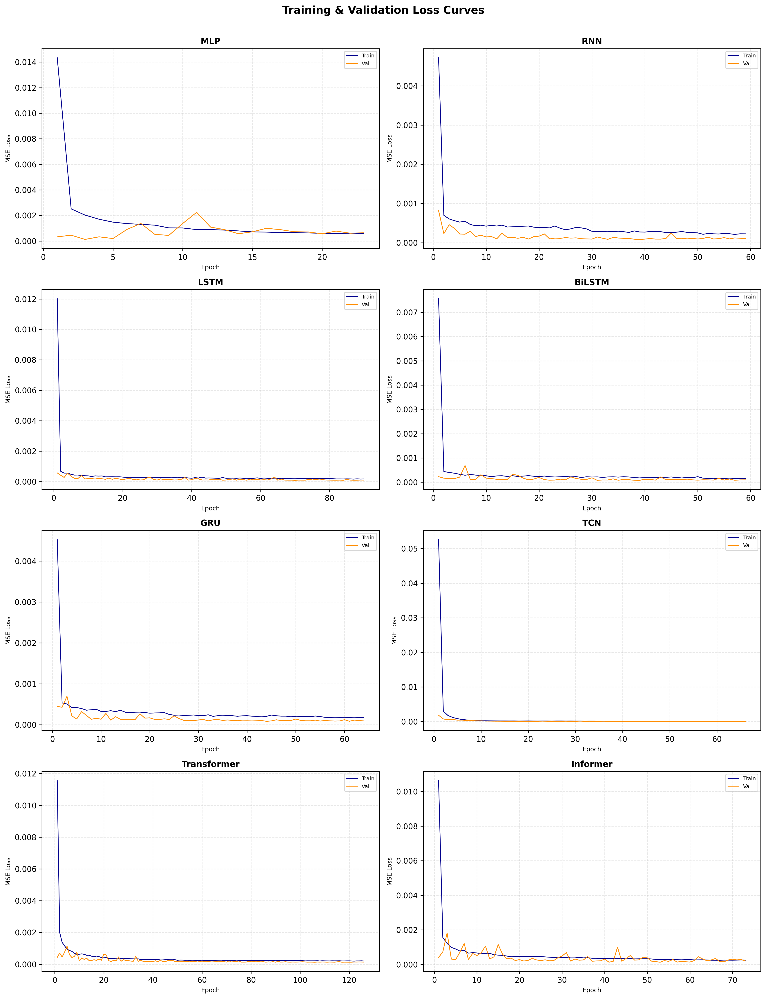

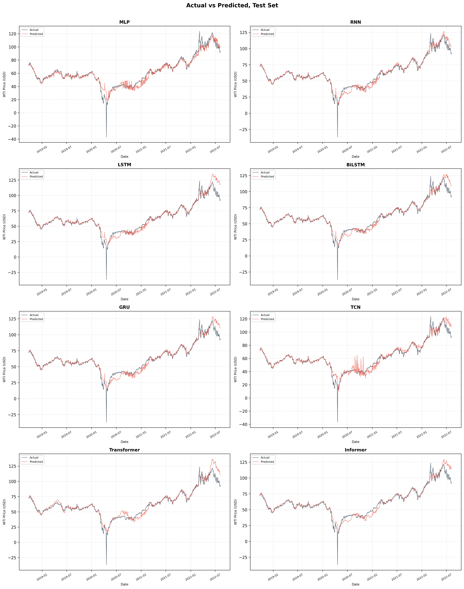

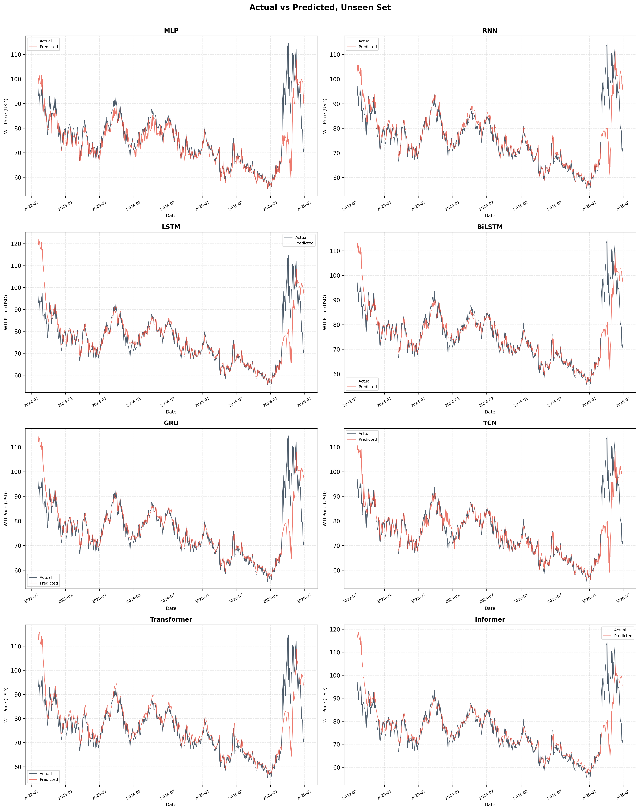

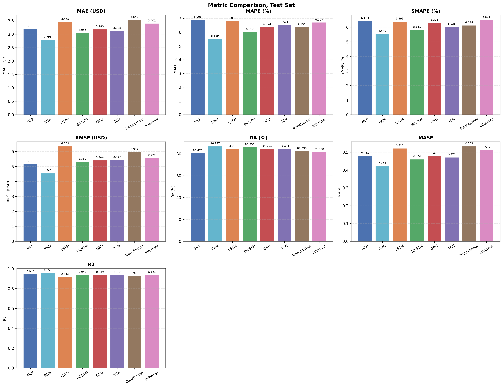

## 6. XAI (Explainable AI, SHAP dan Integrated Gradients)

### 6.1. Alasan dan Kenapa 2 Teknik XAI Dipilih

Model deep learning pada dasarnya kotak hitam, akurat belum tentu bisa dijelaskan. Tahap ini membedah 8 model terlatih untuk melihat bagian input mana (komponen CEEMDAN mana, dan hari ke berapa dari 10 hari window) yang paling berpengaruh terhadap tiap prediksi.

Dua metode dipakai SEKALIGUS, bukan satu saja, supaya temuan tidak bergantung pada bias satu metode.

**SHAP** (`shap.GradientExplainer`), berbasis teori permainan (game theory), mengukur kontribusi tiap fitur dengan membandingkan prediksi terhadap sekumpulan data latar belakang (background), pendekatan yang punya jaminan matematis soal keadilan pembagian kontribusi antar fitur.
**Integrated Gradients** (`captum`), berbasis integral gradien sepanjang jalur dari titik baseline (nol) ke input aktual, pendekatan aksiomatik yang populer khusus untuk model neural network (memakai gradien langsung, bukan sampling seperti SHAP).

Kalau kedua metode yang cara kerjanya beda ini menunjukkan pola yang SAMA, temuannya jauh lebih meyakinkan dibanding cuma mengandalkan satu metode saja (yang mungkin menunjukkan pola karena kelemahan/bias metode itu sendiri, bukan karena modelnya memang begitu).

### 6.2. Code Snippet

Sumber, `09-xai-explainability.py`, dataset dimuat langsung dari `splits.npz` (sudah pre-windowed dari Bagian 3-4, tidak perlu membangun ulang sequence).

```python
XAI_EVAL_SAMPLE_SIZE = 200   # subsample window per split, SHAP+IG mahal
SHAP_BACKGROUND_SIZE = 200
SHAP_NSAMPLES = 50
IG_STEPS = 50

def compute_shap_attributions(model, X_bg, X_eval, device, n_repeats, seed=SEED):
  bg_t = torch.tensor(X_bg, dtype=torch.float32, device=device)
  eval_t = torch.tensor(X_eval, dtype=torch.float32, device=device)
  runs = []
  for r in range(n_repeats):
    torch.manual_seed(seed + r)
    explainer = shap.GradientExplainer(model, bg_t)
    sv = explainer.shap_values(eval_t, nsamples=SHAP_NSAMPLES)
    sv = np.asarray(sv[0] if isinstance(sv, list) else sv)
    if sv.ndim == eval_t.dim() + 1 and sv.shape[-1] == 1:
      sv = sv[..., 0]
    runs.append(sv)
  return np.mean(runs, axis=0)


def compute_ig_attributions(model, X_eval, device, n_repeats, seed=SEED, batch_size=64):
  ig = IntegratedGradients(model)
  eval_t = torch.tensor(X_eval, dtype=torch.float32, device=device)
  runs = []
  for r in range(n_repeats):
    torch.manual_seed(seed + r)
    attrs = []
    for i in range(0, len(eval_t), batch_size):
      batch = eval_t[i: i + batch_size]
      baseline = torch.zeros_like(batch)
      a = ig.attribute(batch, baselines=baseline, n_steps=IG_STEPS)
      attrs.append(a.detach().cpu().numpy())
    runs.append(np.concatenate(attrs, axis=0))
  return np.mean(runs, axis=0)
```

Informer punya lapisan attention yang memakai `torch.randint` (memilih kandidat key secara acak), jadi forward pass-nya TETAP stokastik meski model sudah dalam mode eval, beda dengan 7 model lain yang deterministik penuh. Khusus Informer, atribusinya dirata rata dari 10 kali pengulangan supaya stabil, model lain cukup 1 kali.

```python
STABILITY_REPEATS = {
    "MLP": 1, "RNN": 1, "LSTM": 1, "BiLSTM": 1, "GRU": 1, "TCN": 1,
    "Transformer": 1, "Informer": 10,
}
```

Skor konsentrasi (0 = atribusi menyebar rata, 1 = terpusat penuh ke satu komponen/timestep), dipakai untuk menguji apakah model yang atribusinya lebih terpusat cenderung lebih akurat.

```python
def concentration_score(v):
  """1 - normalized Shannon entropy. 0 = menyebar rata, 1 = terpusat penuh."""
  v = np.asarray(v, dtype=np.float64).reshape(-1)
  if v.sum() <= 0 or len(v) <= 1:
    return 0.0
  p = v / v.sum()
  h = scipy_entropy(p, base=2)
  h_max = math.log2(len(v))
  return float(1.0 - (h / h_max if h_max > 0 else 0.0))
```

### 6.3. Hasil dan Temuan

**Temuan 1, Trend paling dipercaya model.** Dari 4 komponen input (Trend, IMF_Group1, IMF_Group2, Residual), Trend selalu jadi yang paling berpengaruh terhadap prediksi, di SEMUA 8 model, di SEMUA data yang diuji. Bukan menang tipis, tapi menang jauh, sekitar 61% sampai 82% dari total "perhatian" model tertuju ke Trend saja, sisanya (3 komponen lain digabung) cuma kebagian sedikit.

| Data yang diuji | Porsi perhatian model ke Trend |
|---|---|
| Run `full`, Test | 61% - 70% |
| Run `full`, Unseen | 74% - 79% |
| Run `wu`, Test | 75% - 82% |

**Temuan 2, yang membedakan model bagus dan kurang bagus BUKAN soal komponen, tapi soal HARI.** Awalnya diduga, model yang "fokus" ke satu komponen tertentu (misal fokus ke Trend saja) akan lebih akurat dibanding model yang perhatiannya menyebar ke 4 komponen. Ternyata dugaan ini TIDAK TERBUKTI, tidak ada hubungan antara seberapa fokus model ke satu komponen dengan seberapa akurat model itu.

Yang justru terbukti berhubungan adalah seberapa fokus model ke HARI TERTENTU dalam 10 hari window. Model yang lebih fokus ke hari PALING BARU (hari kemarin, `lag_1`) cenderung lebih akurat, model yang perhatiannya menyebar rata ke 10 hari cenderung KURANG akurat. Hubungan ini konsisten muncul di ketiga data yang diuji (secara statistik meyakinkan, bukan kebetulan).

| Data yang diuji | Fokus ke komponen, ada hubungan dengan akurasi? | Fokus ke hari terbaru, ada hubungan dengan akurasi? |
|---|---|---|
| Run `full`, Test | Tidak (angka hubungan lemah, kemungkinan cuma kebetulan) | **Ya (hubungan kuat, meyakinkan secara statistik)** |
| Run `full`, Unseen | Tidak | **Ya** |
| Run `wu`, Test | Tidak | **Ya** |

Contoh konkret (run `full`, Test), TCN dan RNN sama sama sangat fokus ke hari terbaru, dan sama sama termasuk model paling akurat. Transformer dan Informer perhatiannya menyebar rata ke 10 hari, dan sama sama termasuk model paling kurang akurat di antara model yang membaca sequence.

**Kesimpulan.** Bukan "model yang fokus ke satu komponen tertentu yang menang", melainkan "model yang secara alami condong mengutamakan hari paling baru yang menang". TCN (lewat cara kerja convolution-nya yang memang dekat ke hari terbaru) dan RNN (lewat sifat bawaannya yang membuat pengaruh hari-hari lama meluruh) diuntungkan. Transformer dan Informer dirancang untuk menimbang SEMUA hari secara adil, padahal justru hari terbarulah yang paling penting di data ini, jadi desain "adil ke semua hari" ini malah jadi kelemahan.

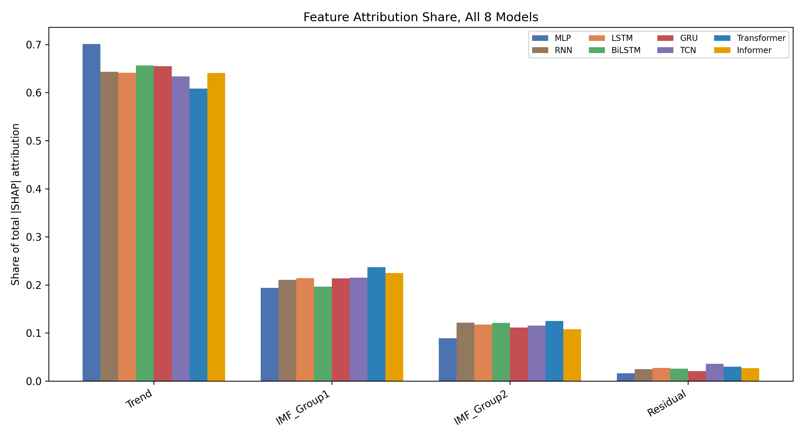

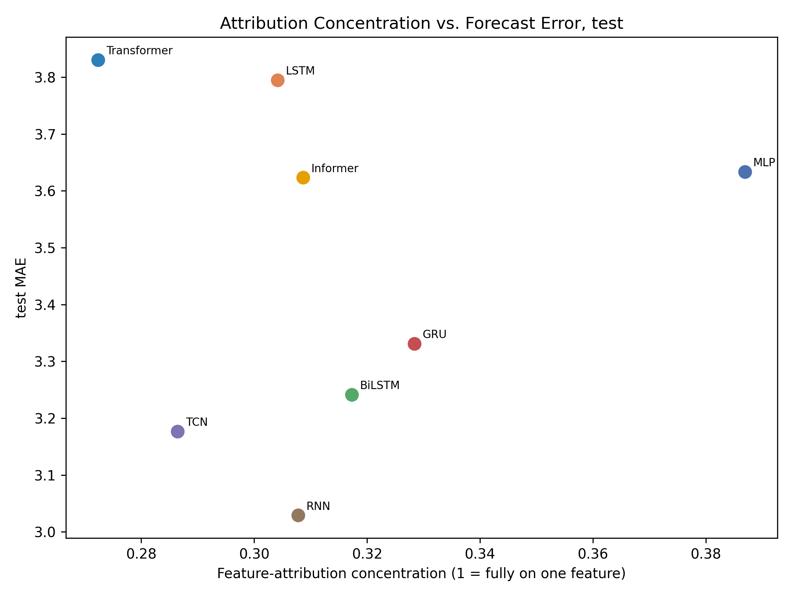

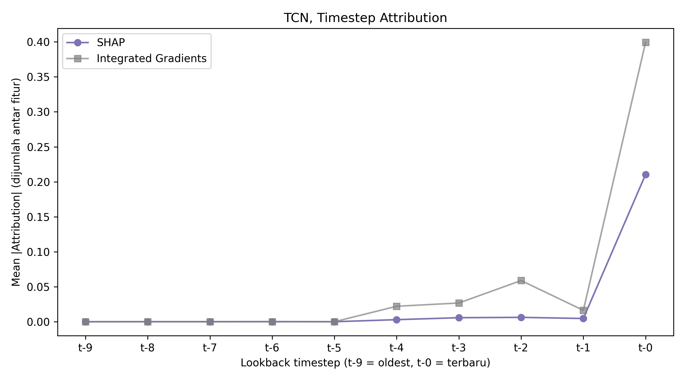

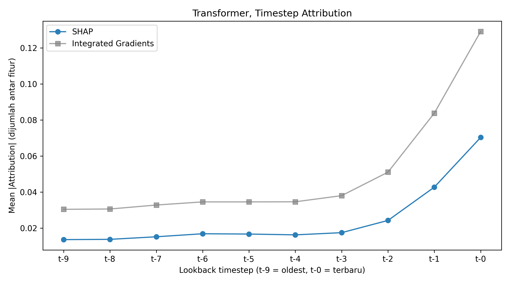

**Cara membaca ringkas.** Grafik batang, tiap kelompok batang = satu komponen input, batang Trend selalu paling tinggi di semua model, itulah dominasi Trend. Grafik scatter, sumbu X = seberapa fokus model ke satu komponen, sumbu Y = MAE, titik menyebar acak tanpa pola artinya tidak ada hubungan. Grafik garis (per hari), sumbu X = hari dalam window (kiri = paling lama, kanan = paling baru), garis yang melonjak tajam ke kanan (seperti TCN) berarti model sangat mengandalkan hari terbaru, garis yang rata (seperti Transformer) berarti model menimbang semua hari sama rata.

### 6.4. Saran Perbaikan dari Temuan XAI

**Transformer dan Informer**, buat lebih "sadar" hari terbaru, dengan mengubah cara model menandai posisi hari (jadi bisa ikut belajar sendiri) dan cara merangkum window jadi satu ringkasan (ambil dari hari terakhir, bukan rata-rata semua hari).
**MLP**, model paling lemah tapi tidak bisa didiagnosis lewat XAI (karena cuma baca 1 hari), jadi kandidat tuning hyperparameter (ukuran layer, dropout, learning rate).

#### Alasan dan Kenapa

Transformer dan Informer punya 2 bagian yang "netral" terhadap waktu, positional encoding sinusoidal (pola tetap, tidak ikut belajar) dan mean pooling (rata-rata semua 10 hari sama rata). Padahal XAI (Bagian 6.3) menunjukkan hari terbaru jauh lebih penting, jadi dua bagian itulah yang diganti, arsitektur inti (layer, head) tetap sama supaya perbandingan adil.

Positional encoding diganti jadi TERLATIH, supaya model bebas belajar sendiri bobot posisi mana yang penting. Pooling diganti jadi ambil ringkasan HANYA dari hari terakhir (`x[:, -1, :]`), bukan rata-rata semua hari.

MLP tidak ikut diubah arsitekturnya (tidak relevan, MLP tidak punya window), tapi dijadikan kandidat tuning hyperparameter otomatis (Optuna), untuk menguji apakah kelemahannya soal pengaturan pelatihan, bukan struktur.

#### Code Snippet

Sumber, `10-recency-bias-fix.py` (Transformer/Informer) dan `11-hyperparameter-tuning.py` (MLP), keduanya proyek ini.

Positional encoding terlatih, menggantikan `PositionalEncoding` sinusoidal Bagian 5.

```python
class LearnedPositionalEncoding(nn.Module):
  """Learned (trainable) positional embedding, one vector per lookback
  slot, instead of a fixed sinusoidal pattern. Lets gradient descent shape
  the position vectors directly, including a recency skew, rather than
  relying on a fixed encoding the model has no incentive to weight unevenly."""

  def __init__(self, d_model, max_len, dropout=0.1):
    super().__init__()
    self.dropout = nn.Dropout(dropout)
    self.pos_embed = nn.Parameter(torch.zeros(1, max_len, d_model))
    nn.init.trunc_normal_(self.pos_embed, std=0.02)

  def forward(self, x):
    return self.dropout(x + self.pos_embed[:, :x.size(1), :])
```

**Transformer**, satu-satunya baris yang berubah dari Bagian 5 adalah `pos_enc` dan baris terakhir `forward` (`x[:, -1, :]` ganti `x.mean(dim=1)`).

```python
class TransformerModelFixed(nn.Module):
  """Encoder-only Transformer with learned positional encoding and
  last-timestep pooling instead of Stage 05's sinusoidal PE + mean pooling."""

  def __init__(self):
    super().__init__()
    d_model = 32
    self.input_proj = nn.Linear(N_FEATURES, d_model)
    self.pos_enc = LearnedPositionalEncoding(d_model, max_len=LOOKBACK, dropout=0.1)
    enc_layer = nn.TransformerEncoderLayer(
        d_model=d_model, nhead=4, dim_feedforward=64,
        dropout=0.1, activation='relu', batch_first=True
    )
    self.encoder = nn.TransformerEncoder(enc_layer, num_layers=2)
    self.fc = nn.Linear(d_model, 1)

  def forward(self, x):
    x = self.pos_enc(self.input_proj(x))
    x = self.encoder(x)
    return self.fc(x[:, -1, :])   # last-timestep pooling, bukan x.mean(dim=1)
```

**Informer**, perubahan identik (`pos_enc` dan pooling), lapisan ProbSparse attention-nya sendiri TIDAK diubah.

```python
class InformerModelFixed(nn.Module):
  """Informer encoder-only model with learned positional encoding and
  last-timestep pooling instead of Stage 05's sinusoidal PE + mean pooling.
  ProbSparse attention itself is unchanged."""

  def __init__(self):
    super().__init__()
    d_model = 32
    self.input_proj = nn.Linear(N_FEATURES, d_model)
    self.pos_enc = LearnedPositionalEncoding(d_model, max_len=LOOKBACK, dropout=0.1)
    self.layers = nn.ModuleList([
        InformerEncoderLayer(d_model, n_heads=4, d_ff=64, dropout=0.1),
        InformerEncoderLayer(d_model, n_heads=4, d_ff=64, dropout=0.1),
    ])
    self.fc = nn.Linear(d_model, 1)

  def forward(self, x):
    x = self.pos_enc(self.input_proj(x))
    for layer in self.layers:
      x = layer(x)
    return self.fc(x[:, -1, :])   # last-timestep pooling, bukan x.mean(dim=1)
```

**MLP**, bentuk 4 layer tetap sama seperti Bagian 5, hanya lebar layer (`h1`, `h2`, `h3`) dan `dropout` dijadikan parameter yang bisa dicari otomatis.

```python
class MLPModelTunable(nn.Module):
  """Same 4-layer MLP shape as Stage 05, with widths/dropout exposed for
  Optuna to search."""

  def __init__(self, h1=128, h2=64, h3=32, dropout=0.2):
    super().__init__()
    self.net = nn.Sequential(
        nn.Linear(N_FEATURES, h1), nn.ReLU(), nn.Dropout(dropout),
        nn.Linear(h1, h2),         nn.ReLU(), nn.Dropout(dropout),
        nn.Linear(h2, h3),         nn.ReLU(),
        nn.Linear(h3, 1)
    )

  def forward(self, x):
    return self.net(x)


def objective_mlp(trial, train_ld, val_ld, device):
  h1 = trial.suggest_categorical('h1', [64, 128, 256])
  h2 = trial.suggest_categorical('h2', [32, 64, 128])
  h3 = trial.suggest_categorical('h3', [16, 32, 64])
  dropout = trial.suggest_float('dropout', 0.0, 0.4)
  lr = trial.suggest_float('lr', 1e-4, 3e-3, log=True)
  weight_decay = trial.suggest_categorical('weight_decay', [0.0, 1e-5, 1e-4])

  model = MLPModelTunable(h1, h2, h3, dropout)
  _, hist = train_model(
      model, train_ld, val_ld, lr, device, weight_decay=weight_decay,
      max_epochs=TUNE_MAX_EPOCHS, patience=TUNE_PATIENCE, trial=trial
  )
  return min(hist['val_loss'])   # Optuna cari kombinasi dgn val loss terendah
```

Optuna (TPE sampler + MedianPruner) mencoba banyak kombinasi hyperparameter secara otomatis, tiap kombinasi dilatih ringan dulu (budget epoch lebih kecil, `TUNE_MAX_EPOCHS`), kombinasi yang jelas jelek dihentikan lebih awal (pruning) supaya pencarian lebih cepat, baru kombinasi terbaik dilatih penuh (budget sama seperti Bagian 5) untuk mendapat model final.

### 6.5. Hasil Perbaikan, Sebelum vs Sesudah

**Transformer dan Informer (run `full`), Test set.**

| Model | Varian | MAE | DA% | R2 | Konsentrasi timestep |
|---|---|---:|---:|---:|---:|
| Transformer | Baseline | 3.5398 | 82.33 | 0.9257 | 0.0765 |
| Transformer | Fixed | 3.5732 | 82.64 | 0.9205 | **0.1625** |
| Informer | Baseline | 3.4012 | 81.51 | 0.9343 | 0.0743 |
| Informer | Fixed | **2.9913** | **85.95** | **0.9548** | **0.1590** |

**Transformer dan Informer (run `wu`), Test set.**

| Model | Varian | MAE | DA% | R2 | Konsentrasi timestep |
|---|---|---:|---:|---:|---:|
| Transformer | Baseline | 1.7047 | 85.78 | 0.9868 | 0.0340 |
| Transformer | Fixed | **1.5877** | **86.53** | **0.9885** | **0.0965** |
| Informer | Baseline | 1.6921 | 84.67 | 0.9870 | 0.0144 |
| Informer | Fixed | **1.4374** | **88.81** | **0.9894** | **0.1563** |

Konsentrasi timestep NAIK di keempat kombinasi (bukti perbaikan berhasil membuat model lebih condong ke hari terbaru, sesuai tujuan). Tapi efeknya ke akurasi CAMPURAN, Informer membaik jelas di semua skenario, Transformer membaik di run `wu` tapi sedikit memburuk di run `full` Test (MAE 3.5398 jadi 3.5732). Perbaikan ini bukan jaminan otomatis lebih akurat, tapi konsisten membuktikan mekanismenya bekerja sesuai rancangan (konsentrasi naik).

**MLP, hasil tuning hyperparameter.**

| Run | Split | Varian | MAE | DA% | R2 |
|---|---|---|---:|---:|---:|
| full | Test | Baseline | 3.1983 | 80.48 | 0.9440 |
| full | Test | Tuned | **2.6613** | **87.71** | **0.9540** |
| full | Unseen | Baseline | 3.1099 | 85.04 | 0.6527 |
| full | Unseen | Tuned | **2.8475** | **88.34** | **0.6988** |
| wu | Test | Baseline | 2.4679 | 81.89 | 0.9722 |
| wu | Test | Tuned | **1.2938** | **88.81** | **0.9904** |

MLP membaik signifikan di kedua run, terutama run `wu` (MAE turun hampir separuh, 2.4679 jadi 1.2938), nyaris menyamai TCN sebagai model terbaik run tersebut. Ini mengkonfirmasi dugaan Bagian 6.4, kelemahan MLP memang lebih ke pengaturan pelatihan yang belum optimal, bukan keterbatasan struktural arsitekturnya.

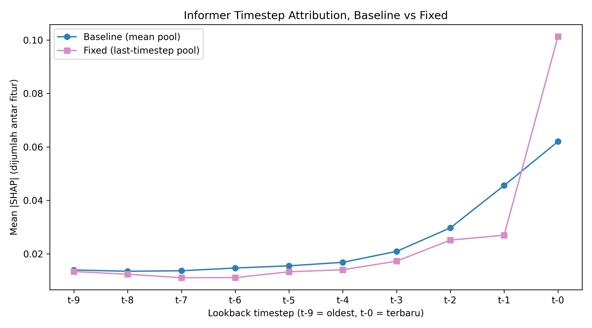

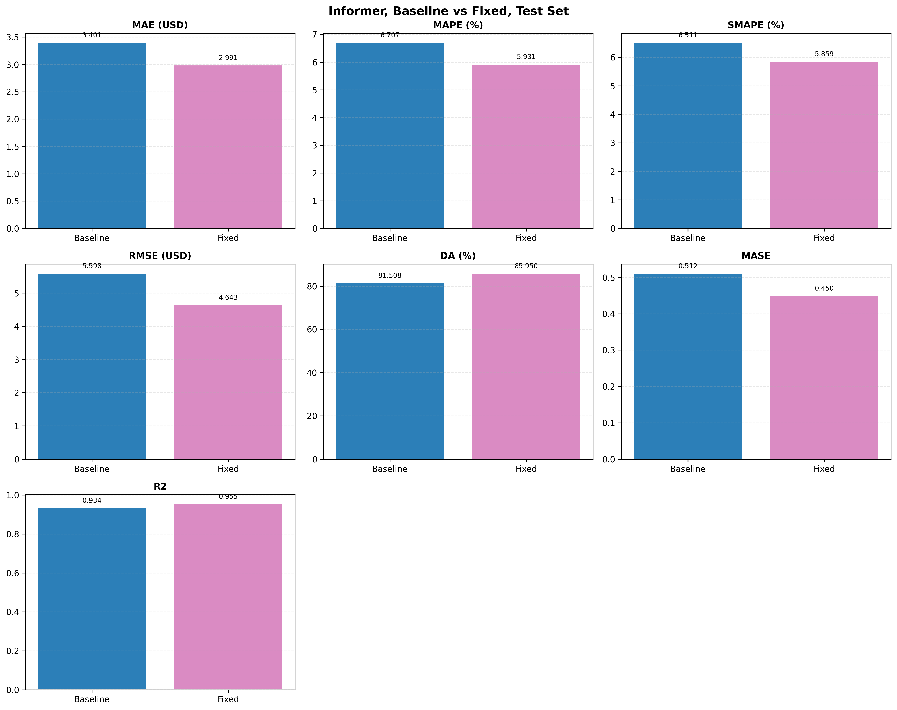

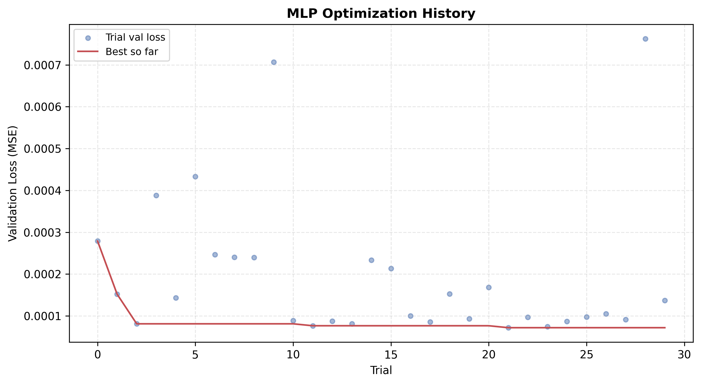

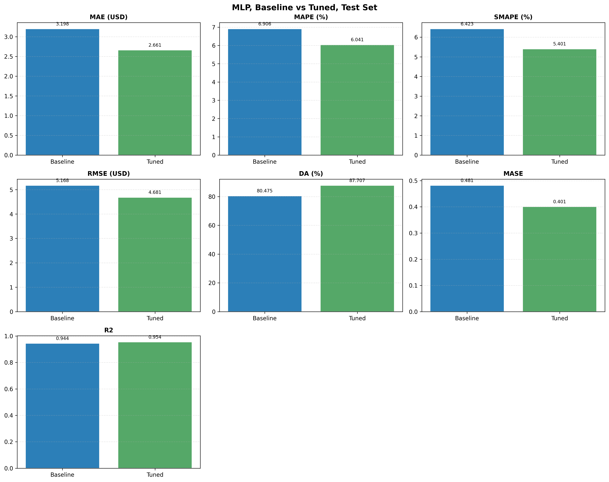

Cara membaca, grafik perbandingan timestep menunjukkan garis Fixed lebih condong ke hari terbaru dibanding Baseline (konsentrasi naik). Grafik riwayat optimasi Optuna menunjukkan val loss tiap percobaan trial, garis makin menurun/mendatar berarti pencarian makin mendekati kombinasi terbaik.

## 7. Benchmark dengan Wu et al. (ICEEMDAN SCA-RVFL)

### 7.1. Dataset Wu vs Dataset Kami Setelah Dekomposisi

Pada rentang tanggal yang SAMA (sampai 2020-02-10), data Wu et al. lebih banyak 510 baris dari data kami.

| Sumber | Rentang tanggal | Jumlah baris |
|---|---|---:|
| Wu et al. | 1986-01-02 s.d. 2020-02-10 | 8.596 |
| Kami (run `wu`) | 1988-01-11 s.d. 2020-02-10 | 8.086 |
| Selisih | | 510 |

Selisihnya berasal dari dua "biaya warmup" yang sudah dibahas sebelumnya.

500 baris, dari warmup LOWESS/CEEMDAN (Bagian 1.2). Hari-hari paling awal (1986-1987) riwayatnya belum cukup panjang untuk dihitung Trend-nya secara wajar, jadi dilewati, sama seperti moving average butuh beberapa data dulu sebelum bisa menghasilkan angka.
10 baris, dari kebutuhan Feature Engineering (Bagian 3.2), untuk membentuk 1 baris data siap pakai, dibutuhkan 10 hari riwayat sebelumnya (`lag_1` sampai `lag_10`), jadi 10 hari pertama setelah warmup di atas juga ikut tidak bisa dipakai.

500 + 10 = 510, pas sama dengan selisihnya. Wu et al. tidak kehilangan baris sama sekali karena cara mereka mendekomposisi data beda, mereka olah SELURUH data sekaligus dalam satu kali proses (bukan per hari maju satu-satu seperti kami), jadi tidak butuh "pemanasan" apa pun.

Akibatnya, data latih (Train) kami juga otomatis lebih pendek dan mulai lebih telat dibanding Wu et al., meski keduanya berhenti di tanggal yang sama (2020-02-10).

### 7.2. Tabel Perbandingan (Wu et al., Run `wu`, Run `full`)

MAPE dan DA kami dikonversi ke skala fraksi (bukan persen) supaya sebanding langsung dengan satuan Wu et al. (MAPE, Dstat).

| Sumber | Model | MAPE | RMSE | Dstat |
|---|---|---:|---:|---:|
| Wu et al. Table 4, ICEEMDAN | SCA-RVFL | **0.0035** | **0.2801** | **0.9273** |
| Wu et al. Table 4, ICEEMDAN | RVFL | 0.0040 | 0.3187 | 0.9186 |
| Wu et al. Table 4, ICEEMDAN | LSSVR | 0.0047 | 0.3559 | 0.9093 |
| Wu et al. Table 4, ICEEMDAN | BPNN | 0.0045 | 0.3601 | 0.8988 |
| Wu et al. Table 4, ICEEMDAN | ARIMA | 0.0121 | 0.8205 | 0.7720 |
| Wu et al. Table 4, EEMD | SCA-RVFL | 0.0086 | 0.6340 | 0.8045 |
| Wu et al. teks, model tunggal | SCA-RVFL | 0.0157 | 1.2183 | 0.7522 |
| Kami, run `wu` | MLP | 0.0439 | 3.2932 | 0.8189 |
| Kami, run `wu` | RNN | 0.0233 | 1.8954 | 0.8857 |
| Kami, run `wu` | LSTM | 0.0277 | 2.0853 | 0.8640 |
| Kami, run `wu` | BiLSTM | 0.0245 | 1.9594 | 0.8770 |
| Kami, run `wu` | GRU | 0.0266 | 2.0638 | 0.8646 |
| Kami, run `wu` | TCN | **0.0224** | **1.8762** | **0.8918** |
| Kami, run `wu` | Transformer | 0.0299 | 2.2688 | 0.8578 |
| Kami, run `wu` | Informer | 0.0299 | 2.2532 | 0.8467 |
| Kami, run `wu` | MLP Tuned | 0.0230 | 1.9330 | 0.8881 |
| Kami, run `full` | MLP | 0.0691 | 5.1681 | 0.8048 |
| Kami, run `full` | RNN | **0.0553** | **4.5414** | 0.8678 |
| Kami, run `full` | LSTM | 0.0681 | 6.3389 | 0.8430 |
| Kami, run `full` | BiLSTM | 0.0601 | 5.3297 | 0.8595 |
| Kami, run `full` | GRU | 0.0637 | 5.4059 | 0.8471 |
| Kami, run `full` | TCN | 0.0652 | 5.4572 | 0.8440 |
| Kami, run `full` | Transformer | 0.0640 | 5.9522 | 0.8233 |
| Kami, run `full` | Informer | 0.0671 | 5.5975 | 0.8151 |
| Kami, run `full` | MLP Tuned | 0.0604 | 4.6811 | **0.8771** |

Dua pola penting terlihat dari tabel ini.

Run `wu` SELALU lebih baik dari run `full` di semua model yang sama (MAPE run `wu` sekitar separuh dari run `full`), karena run `wu` berhenti di 2020-02-10 (SEBELUM crash harga minyak COVID 2020), sementara run `full` mencakup rentang harga jauh lebih liar (Bagian 5.4).
Run `wu` sengaja dipertahankan sebagai basis perbandingan resmi terhadap Wu et al. (bukan run `full`), karena run `wu` meniru rentang data studi acuan, membandingkan run `full` langsung ke Wu et al. akan menambah faktor pembeda lagi di luar 4 faktor yang sudah ada (Bagian 7.4).

### 7.3. Kenapa Hasil Kami Tidak Lebih Baik dari Wu

Secara angka mentah, model terbaik kami (TCN, MAPE 0,0224) memang masih jauh di bawah metode terbaik Wu et al. (SCA-RVFL, MAPE 0,0035), sekitar 6 kali lebih besar errornya. Ini FAKTA, bukan sesuatu yang perlu ditutup-tutupi.

Ada beberapa alasan yang masuk akal kenapa gap ini terjadi, tapi alasan-alasan ini adalah KONTEKS untuk memahami perbandingannya, bukan alasan untuk mengklaim model kami "sebenarnya sama bagusnya".

Cara Wu et al. mengolah datanya SEDIKIT MENGUNTUNGKAN mereka. Mereka memecah seluruh data (termasuk bagian yang dipakai untuk menguji model) sekaligus dalam satu proses, jadi ada kemungkinan sedikit "bocoran" informasi dari masa depan ikut membantu hasil dekomposisi di bagian pengujian. Kami sengaja tidak melakukan ini, kami memecah data selangkah demi selangkah, cuma pakai data yang sudah lewat di tiap harinya, supaya lebih mendekati kondisi nyata (menebak harga besok tanpa tahu apa-apa soal besok).
Cara Wu et al. menyusun model juga beda, mereka melatih model TERPISAH untuk tiap potongan hasil dekomposisi lalu menjumlahkan semua hasilnya, sementara kami melatih SATU model untuk membaca gabungan 4 komponen sekaligus.

Kalau dibandingkan ke baris Wu et al. yang paling mendekati cara kerja kami (satu model saja, tanpa gabungan banyak model per potongan dekomposisi), model kami (TCN) justru sedikit LEBIH BAIK dalam menebak arah naik/turun harga (Dstat 0,89 vs 0,75), walau masih kalah di ketepatan angka (MAPE).

Kesimpulan yang jujur, sebagian gap ini memang wajar terjadi karena kami sengaja memilih cara kerja yang lebih ketat/realistis (tidak mengintip masa depan), tapi ini TIDAK berarti model kami "setara" dengan Wu et al. secara keseluruhan, cara kerja yang lebih ketat memang secara alami akan menghasilkan angka yang tidak sebagus cara kerja yang lebih longgar, itu konsekuensi yang harus diterima, bukan prestasi yang perlu dibesar-besarkan.
